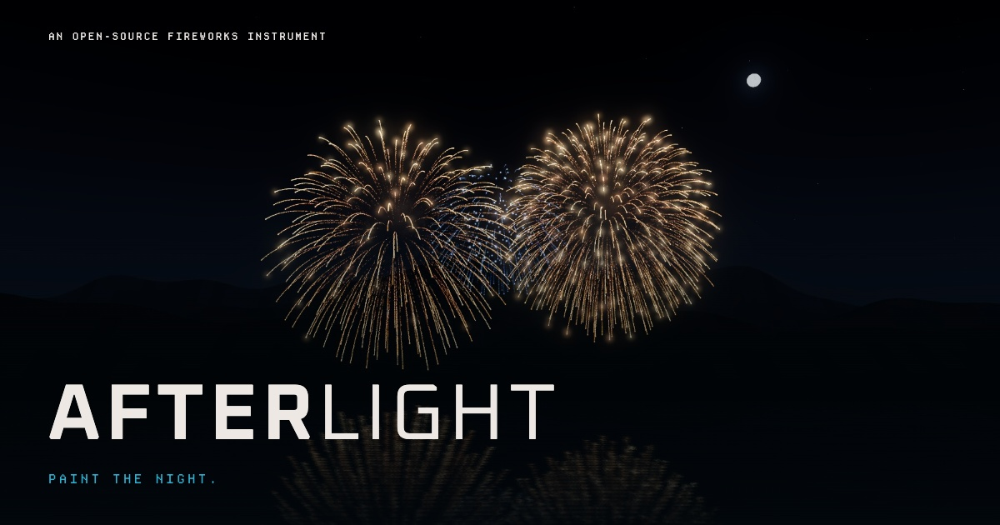

# AFTERLIGHT

**Paint the night.** An MIT-licensed 3D fireworks instrument with a widescreen lake, a pictogram pad, original spatial audio, and a finale you build by stacking effects.

[Play AFTERLIGHT](https://fireworks.prodyn.ai/)



## Play

- Tap a firework to fire it. Tap the sky to choose a launch position and height.
- Six banks hold 40 effects. The selected effect remains on the Space key.
- Choose a fixed palette—including red/white/blue and Guatemala blue/white—or let Signature cycle through each effect's authored looks. Smiley always uses a yellow ring, blue eye circles and a red mouth.
- Successive launches step from farther away toward the audience. Wide view opens more lateral firing room.
- Tap **+** to add an effect and its colour to the **Finale**. Stack up to 12 layers; choose each layer’s density and a 12–45 second build. Layers overlap and converge for the finish.
- Sound is opt-in. Flashes and reports are separated by acoustic distance; the original sound engine varies lift, burst, crackle, hiss and whistle signatures.
- Export a show as JSON or copy a link with the show in its URL fragment. The app does not upload it.
- Cinema mode hides the controls and expands the 16:9 sky. Tap the sky to keep firing; **Show controls** brings the instrument back.
- Install from the app menu. Once the complete app has been cached online, it runs offline—including the sky, fonts and sound.

Keyboard: **1–8** fire from the current bank · **Shift + 1–8** add a layer · **Space** fire selected · **P** pause · **F** start/stop the finale · **M** sound.

## Run locally

Use Node 22.12 or newer. From the source directory:

```sh
npm ci
npm run dev
```

The development server binds to loopback. For the actual offline app, build and serve the production output:

```sh
npm run build
npm run preview
```

The static `dist/` directory is the deployable application. No Node server, database, account service or external CDN is needed at runtime.

## Build for your domain

Set the final public URL at build time so the canonical URL and social-card image are absolute:

```sh
SITE_URL=https://your-domain.example/ npm run build
```

Use the actual subdirectory in that URL if applicable. The default relative asset base supports subdirectory hosting. Deploy the **contents** of `dist/` on HTTPS. See [deployment notes](docs/deployment.md) and [PWA lifecycle](docs/pwa.md).

## Development and checks

The checks require Chromium. They discover Microsoft Edge on macOS; otherwise install a test browser with `npx playwright install chromium`.

```sh
npm test
npm run build
npm run test:browser
```

For an existing Chromium executable, set `CHROMIUM_PATH` for the app browser suite and `PLAYWRIGHT_CHROMIUM_EXECUTABLE_PATH` for the PWA fixtures. The app suite starts a loopback production preview on port 4179; use `AFTERLIGHT_PORT` to change it. The optional Web Audio browser test is documented in [audio.md](docs/audio.md#reproduce-and-verify).

- [Firework research and terminology](docs/research/fireworks.md)
- [Renderer architecture and fidelity](docs/renderer.md)
- [Original sound design and sample generation](docs/audio.md)
- [Interface and design provenance](docs/design.md)

The public field guide is available inside the app. Effect names describe visible families, not a standardised global taxonomy. Animation timings are authored for this experience, not specifications for physical fireworks.

## Architecture

Vanilla ES modules, Vite and Three.js/WebGL 2. The app owns a single clock; the renderer owns its GPU resources; the composer creates deterministic launch cues; the audio engine owns acoustic scheduling; the service worker owns only this app’s cache scope. There is no analytics or tracking code.

The app starts still when reduced motion is requested. Gentle mode reduces flash intensity; pause freezes the sky. A WebGL failure preserves the composer and the static field guide. Hiding the app suspends the show and mutes sound; returning never automatically restarts sound.

## Licence

Application code, original firework pictograms, procedural graphics and original audio are **MIT licensed**. See [LICENSE](LICENSE).

Three.js and Phosphor Icons retain their MIT notices. Oxanium and Departure Mono are redistributed under **SIL OFL 1.1**, with their notices in [public/licenses/](public/licenses/). The application’s MIT licence does not replace those font licences or the rights in attributed source quotations. PP Neue Machina and ProDyn brand assets are not redistributed.

The interface draws on the ProDyn DSM’s dark field, ivory typography, square geometry and restrained cyan; the sky has its own firework-emission colours. The original fireworks simulation is the visual subject, so decorative DSM atmosphere is deliberately omitted. [Design provenance](docs/design.md).
